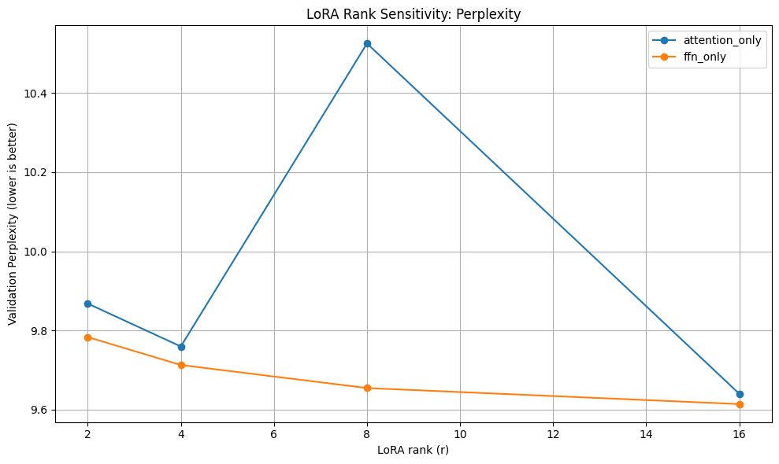
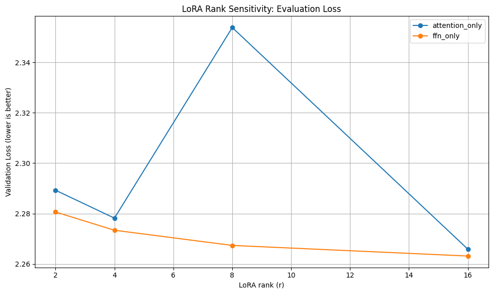

# LoRA Layer-wise Rank Sensitivity Analysis

This project investigates how LoRA (Low-Rank Adaptation) rank and target-layer choice affect fine-tuning quality on **Meta Llama-3.2-3B**. Two LoRA placement strategies — **attention-only** and **FFN-only** — are compared across ranks {2, 4, 8, 16} using the WikiText-2 language modelling benchmark.

> **Full experiment notebook:** [`DSC210_LoRA_Layerwise_Rank_Sensitivity.ipynb`](DSC210_LoRA_Layerwise_Rank_Sensitivity.ipynb)

---

## Table of Contents

- [Background](#background)
- [Experimental Setup](#experimental-setup)
- [Results](#results)
- [Key Findings](#key-findings)
- [How to Reproduce](#how-to-reproduce)

---

## Background

**LoRA** (Low-Rank Adaptation) is a parameter-efficient fine-tuning method that injects trainable low-rank matrices into frozen pre-trained weights. Two key design decisions are:

1. **Rank (`r`)** — the dimensionality of the low-rank update matrices. Higher rank means more trainable parameters and greater capacity.
2. **Target modules** — which layers receive LoRA adapters. Common choices for transformer models are the **attention projections** (`q_proj`, `k_proj`, `v_proj`, `o_proj`) and the **feed-forward network (FFN) layers** (`gate_proj`, `up_proj`, `down_proj`).

This experiment isolates the effect of each factor to understand their individual contribution to fine-tuning performance.

---

## Experimental Setup

| Parameter | Value |
|---|---|
| **Base model** | `meta-llama/Llama-3.2-3B` |
| **Dataset** | WikiText-2 (`wikitext-2-raw-v1`) |
| **Sequence length** | 256 |
| **LoRA ranks tested** | 2, 4, 8, 16 |
| **LoRA alpha** | `2 × r` (e.g., alpha = 4 when rank = 2) |
| **LoRA dropout** | 0.05 |
| **Learning rate** | 2e-4 |
| **Optimizer** | AdamW |
| **Epochs** | 1 |
| **Batch size** | 1 (with 16 gradient accumulation steps) |
| **Precision** | FP16 (4-bit NF4 quantization via `bitsandbytes`) |
| **Seed** | 42 |

### LoRA Target Configurations

| Configuration | Target Modules |
|---|---|
| `attention_only` | `q_proj`, `k_proj`, `v_proj`, `o_proj` |
| `ffn_only` | `gate_proj`, `up_proj`, `down_proj` |

---

## Results

### Perplexity vs. Rank

| Config | Rank | Eval Loss | Perplexity | Trainable Params | Total Params | Trainable % |
|---|---|---|---|---|---|---|
| attention_only | 2 | 2.289 | 9.868 | 1,146,880 | 1,804,610,560 | 0.064% |
| attention_only | 4 | 2.278 | 9.759 | 2,293,760 | 1,805,757,440 | 0.127% |
| attention_only | 8 | 2.354 | 10.525 | 4,587,520 | 1,808,051,200 | 0.254% |
| attention_only | 16 | 2.266 | 9.640 | 9,175,040 | 1,812,638,720 | 0.506% |
| ffn_only | 2 | 2.281 | 9.783 | 1,892,352 | 1,805,356,032 | 0.105% |
| ffn_only | 4 | 2.273 | 9.712 | 3,784,704 | 1,807,248,384 | 0.209% |
| ffn_only | 8 | 2.267 | 9.654 | 7,569,408 | 1,811,033,088 | 0.418% |
| ffn_only | 16 | 2.263 | 9.614 | 15,138,816 | 1,818,602,496 | 0.833% |

### Validation Perplexity

### Evaluation Loss

> Refer to the [Jupyter notebook](DSC210_LoRA_Layerwise_Rank_Sensitivity.ipynb) for the full training logs and interactive plots.

---

## Key Findings

1. **FFN-only LoRA is more stable across ranks.** The FFN configuration shows a smooth, monotonic decrease in perplexity as rank increases (9.78 → 9.61), suggesting that FFN layers benefit consistently from additional capacity.

2. **Attention-only LoRA is more sensitive to rank.** The attention configuration exhibits a non-monotonic trend — perplexity *increases* at rank 8 (10.53) before recovering at rank 16 (9.64). This suggests that attention layers are more sensitive to the rank hyper-parameter and may require careful tuning.

3. **FFN layers deliver better perplexity per parameter.** At rank 2, the FFN configuration (9.78 perplexity, ~1.9M params) already outperforms attention at the same rank (9.87, ~1.1M params). At rank 16, FFN achieves the overall best perplexity (9.61) despite using more trainable parameters.

4. **Higher rank does not always help.** The attention-only spike at rank 8 demonstrates that naïvely increasing rank can hurt performance, likely due to overfitting or optimisation difficulty with more parameters under a limited training budget.

5. **Both strategies are extremely parameter-efficient.** Even at rank 16, the FFN configuration trains less than 1% of total parameters while meaningfully reducing perplexity.

---

## How to Reproduce

1. **Open the notebook in Google Colab** (a T4 GPU is sufficient):

   

2. **Set up Hugging Face access** — the notebook prompts for a Hugging Face token to download the gated Llama-3.2-3B model. Make sure you have accepted the [model license](https://huggingface.co/meta-llama/Llama-3.2-3B).

3. **Run all cells** — training all 8 configurations (2 layer types × 4 ranks) takes approximately 2–3 hours on a T4 GPU.